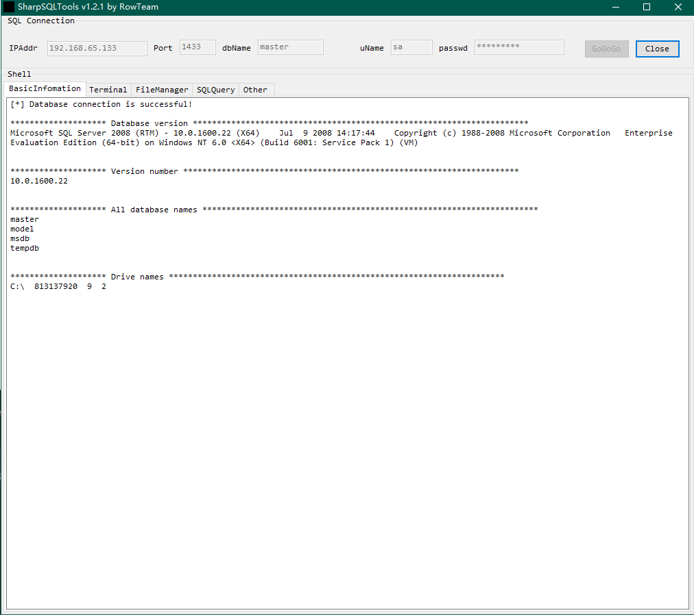
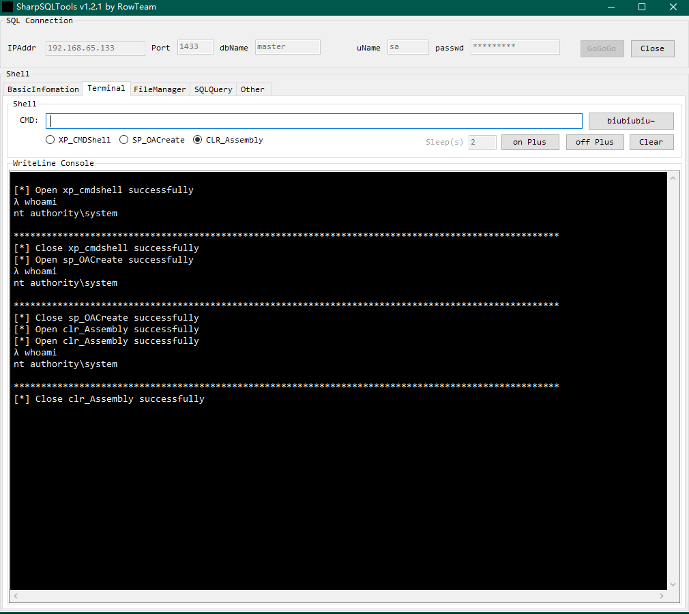
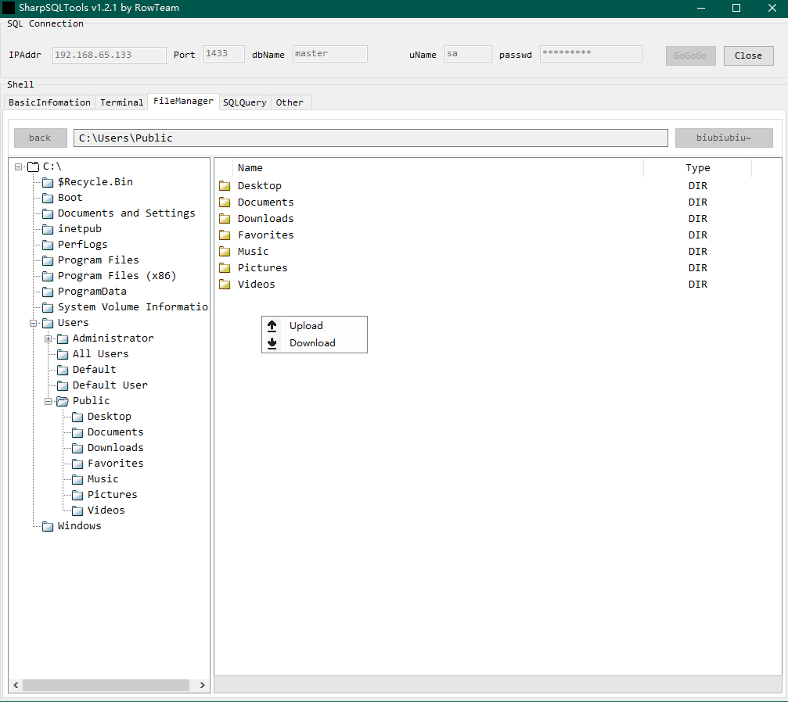

### 简介

需改版，就去看看 https://github.com/uknowsec/SharpSQLTools 的实现。

##### 

### Usage

```
λ SharpSQLTools.exe

   _____ _                      _____  ____  _   _______          _     
  / ____| |                    / ____|/ __ \| | |__   __|        | |    
 | (___ | |__   __ _ _ __ _ __| (___ | |  | | |    | | ___   ___ | |___ 
  \___ \| '_ \ / _` | '__| '_ \\___ \| |  | | |    | |/ _ \ / _ \| / __|
  ____) | | | | (_| | |  | |_) |___) | |__| | |____| | (_) | (_) | \__ \
 |_____/|_| |_|\__,_|_|  | .__/_____/ \___\_\______|_|\___/ \___/|_|___/
                         | |                                            
                         |_|                              
                                                    by Rcoil & Uknow

SharpSQLTools target username password

Module:
    enable_xp_cmdshell         - you know what it means
    disable_xp_cmdshell        - you know what it means
    xp_cmdshell {cmd}          - executes cmd using xp_cmdshell
    enable_ole                 - you know what it means
    disable_ole                - you know what it means
    sp_cmdshell {cmd}          - executes cmd using sp_oacreate
    upload {local} {remote}    - upload a local file to a remote path (OLE required)
    download {remote} {local}  - download a remote file to a local path
    exit                       - terminates the server process (and this session)"

```


### 20210627 添加 GUI

我只是实现功能，不提供免杀。







